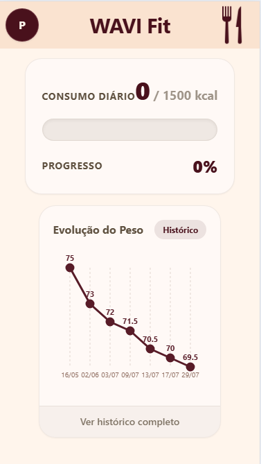
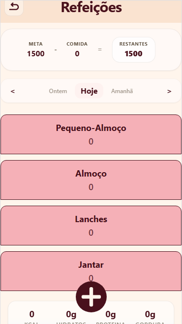
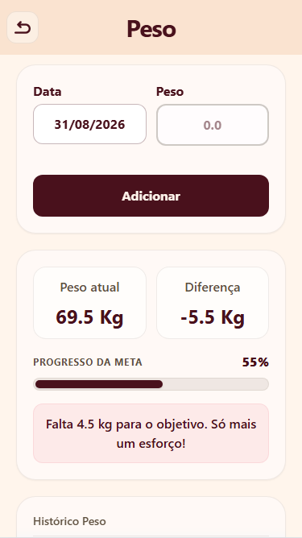
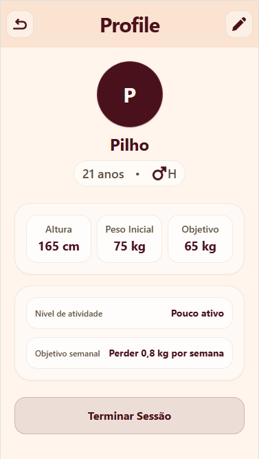

# Wavi Fit

Full-stack nutrition and body-weight tracking app, built to consolidate Next.js, TypeScript, and full-stack architecture skills — with a deliberate focus on algorithmic reasoning and independent problem-solving, minimizing AI-generated code for the core logic and architecture.

🔗 [Live Demo](https://wavi-fit.vercel.app)

## Features

- Calculates Basal Metabolic Rate (Mifflin-St Jeor formula) and TDEE based on individual user data
- Adjusts daily calorie target based on goal (deficit/surplus), with safety floors (1500 kcal men / 1200 kcal women)
- Meal diary with food logging, real-time macro calculation, and carb/protein/fat breakdown
- Weight history with progress tracking against goal
- Day-by-day navigation with dynamic labels ("Today", "Yesterday", "Tomorrow")

## Tech Stack

- Next.js (App Router) + TypeScript
- Supabase (Postgres, Auth, RLS)
- Zod for schema validation
- Recharts for data visualization

## Architecture

Layered architecture: API routes handle validation and control only, delegating database access to dedicated modules in `lib/db/`. Types are split between `models/input` (incoming data) and `models/db-types` (database shape), with calculation logic isolated in `utils/`, kept separate from UI components and routes.

**Supabase schema:** `user_info`, `historico_peso`, `alimentos`, `refeicoes`, `refeicao_alimentos`

## What I Learned

- Relational database modeling and RLS in Supabase
- Schema validation with Zod, including separating input types from response types
- Implementing nutritional calculation algorithms (Mifflin-St Jeor) with business rules and safety constraints
- Custom date/timezone utilities (age calculation, day navigation) built without external libraries
- Next.js App Router: server vs. client components, API routes, `searchParams`/`params` as Promises

## Screenshots

